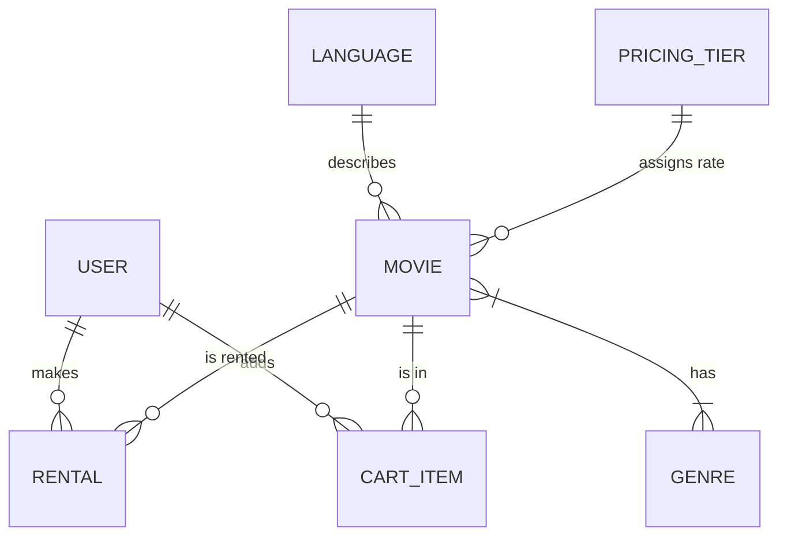

# CineStream - Premium Movie Rental System

A high-end, full-stack movie rental platform built with **Python/Flask**, featuring a fully normalized **2NF/3NF database schema**, automated **TMDB API integration**, and a professional **Amethyst & Midnight** UI design.

---

## 1. Introduction
CineStream is a modern web application designed to simulate a digital movie rental experience. It allows users to browse a vast catalog of movies, filter by language and genre, and rent titles for various durations (2 Days, 1 Week, 1 Month). The system is built with a focus on database integrity, performance, and premium user experience.

## 2. Problem Statement
Traditional movie rental systems often suffer from:
*   **Redundant Data**: Duplicate entries for genres and languages.
*   **Schema Rigidity**: Difficulty in updating pricing across large catalogs.
*   **Poor Discovery**: Lack of automated data synchronization with global movie databases.
*   **Subpar UI**: Generic designs that don't feel "premium" or modern.

CineStream solves these by implementing a normalized relational database and an automated sync engine.

## 3. System Requirements

### Functional Requirements
*   **User Management**: Secure registration and login with hashed passwords.
*   **Automated Catalog**: Integration with TMDB API to fetch real-world movie data (posters, descriptions, ratings).
*   **Dynamic Pricing**: Tiered pricing based on the movie's release year (Premium, Recent, Modern, Vintage).
*   **Shopping Cart**: Multiple-item checkout with duration-based price adjustments.
*   **Admin Dashboard**: Inventory management, database exploration, and manual sync triggers.

### Non-Functional Requirements
*   **Security**: Use of `werkzeug` for secure password hashing.
*   **Performance**: Optimized SQL queries with table joins to ensure fast page loads.
*   **Aesthetics**: A custom "Amethyst & Midnight" theme using CSS3 and Bootstrap 5.
*   **Scalability**: Normalized 2NF schema allows for easy expansion (e.g., adding Actors or Reviews).

## 4. Technology Stack
*   **Backend**: Python 3, Flask Web Framework.
*   **Database**: SQLite (SQLAlchemy ORM) for development; PostgreSQL-ready for production.
*   **Frontend**: HTML5, Vanilla CSS3 (Custom Design System), JavaScript (ES6+), Bootstrap 5.
*   **API**: The Movie Database (TMDB) API for automated content synchronization.

## 5. EER Diagram (Conceptual)

## 6. Relational Model
*   **Users**(id, username, password, is_admin)
*   **Movies**(id, title, description, image_url, release_year, language_id, tier_id, available)
*   **Languages**(id, name, code)
*   **Genres**(id, name)
*   **PricingTiers**(id, name, price, description)
*   **MovieGenres**(movie_id, genre_id) [Junction Table]
*   **Rentals**(id, user_id, movie_id, cost, duration, rental_date, returned)

## 7. Normalization Logic
The database has been refactored to achieve **Second Normal Form (2NF)** and aspects of **3NF**:
*   **1NF**: Eliminated repeating groups (Genres are now in a separate table with a junction table).
*   **2NF**: All non-key attributes (like Language Name or Tier Price) are fully dependent on their own Primary Keys in lookup tables, rather than being repeated in the Movies table.
*   **3NF**: Removed transitive dependencies. Changing a "Tier Price" in the `PricingTier` table automatically updates the cost for all movies in that tier without modifying the `Movie` table itself.

## 8. Database Schema
*   **Languages**: Maps `language_id` to full names (e.g., 1 -> English).
*   **PricingTiers**: Centralizes price logic (e.g., Premium movies = ₹299).
*   **MovieGenres**: Resolves the Many-to-Many relationship between movies and genres.

## 9. Implementation Highlights
*   **Password Safety**: Increased column length to `String(255)` to support high-entropy hashes.
*   **Safe JS Details**: Used HTML5 `data-*` attributes to pass movie data to the UI, preventing crashes from special characters in descriptions.
*   **Auto-Sync**: The app automatically detects a fresh deployment (empty DB) and triggers the TMDB sync engine to populate the catalog.

## 10. Conclusion
CineStream successfully demonstrates how modern web technologies can be combined with rigid database normalization standards to create a professional-grade application. The result is a system that is easy to maintain, visually stunning, and academically sound.

---
**Developer**: Aarnav Nanda Kumar
**Version**: 2.0 (Amethyst Build)
